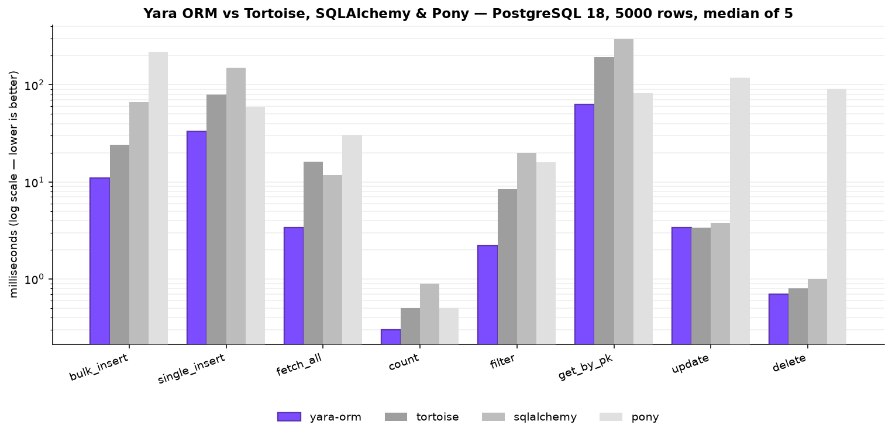

# Performance

Yara ORM is built to be a **fast async Python ORM**: the per-query hot path (parameter
binding, row decoding, pooling) runs in compiled Rust, so steady-state overhead is far
lower than pure-Python ORMs. The numbers below compare Yara ORM against **Tortoise ORM**,
**async SQLAlchemy 2.0** and **Pony ORM** on identical workloads.

!!! note "Methodology"
    Each ORM gets its own table and the **same** workload and data. Every operation is timed
    `BENCH_REPEAT` times and the **median** is reported, so warm steady-state (driver and
    prepared-statement caches hot) dominates over cold-start noise. Treat the numbers as
    indicative throughput, not a micro-benchmark. Full methodology and the runnable script
    live in [`benchmarks/`](https://github.com/vsdudakov/yara-orm/tree/main/benchmarks).

## PostgreSQL



PostgreSQL 18, Apple Silicon, Python 3.12, N=5000, median of 5 (ms, lower is better).

| operation     | yara-orm | tortoise | sqlalchemy |  pony |
|---------------|---------:|---------:|-----------:|------:|
| bulk_insert   |     18.5 |     24.7 |       72.5 | 223.4 |
| single_insert |     33.7 |     82.7 |      157.7 |  61.0 |
| fetch_all     |      3.8 |     17.5 |       23.2 |  35.7 |
| count         |      0.3 |      0.6 |        1.0 |   0.5 |
| group_by      |      0.8 |      1.1 |        1.6 |   2.4 |
| filter        |      2.3 |      9.3 |        8.2 |  17.8 |
| get_by_pk     |     65.8 |    204.4 |      306.9 |  84.6 |
| update        |      3.4 |      3.7 |        4.1 | 120.7 |
| delete        |      0.7 |      0.9 |        1.1 |  95.1 |

`group_by` is a `GROUP BY … COUNT/SUM … HAVING` aggregate query.

**Speedup vs Yara ORM** (competitor time ÷ yara-orm time; >1 means Yara ORM is faster):

| operation     | tortoise | sqlalchemy |  pony |
|---------------|---------:|-----------:|------:|
| bulk_insert   |    1.3×  |      3.9×  | 12.1× |
| single_insert |    2.5×  |      4.7×  |  1.8× |
| fetch_all     |    4.6×  |      6.1×  |  9.4× |
| count         |    1.7×  |      3.0×  |  1.4× |
| group_by      |    1.4×  |      2.0×  |  2.9× |
| filter        |    4.1×  |      3.6×  |  7.8× |
| get_by_pk     |    3.1×  |      4.7×  |  1.3× |
| update        |    1.1×  |      1.2×  | 35.0× |
| delete        |    1.2×  |      1.5×  | 130.2× |

Yara ORM is fastest on every operation in this configuration. `get_by_pk` and
`single_insert` are latency-bound (one sequential round-trip per call) and sit near the raw
client⇄PostgreSQL round-trip floor.

## SQLite

Python 3.12, N=5000, median of 5 (ms, lower is better).

| operation     | yara-orm | tortoise | sqlalchemy |  pony |
|---------------|---------:|---------:|-----------:|------:|
| bulk_insert   |      7.5 |     13.2 |      607.7 |  47.2 |
| single_insert |     35.1 |     27.6 |      235.2 | 117.2 |
| fetch_all     |      4.9 |     38.2 |       11.0 |  48.7 |
| count         |      0.1 |      0.3 |        0.6 |   0.2 |
| filter        |      2.6 |     19.5 |       17.6 |  24.9 |
| get_by_pk     |     54.1 |     79.2 |      329.3 |  30.1 |
| update        |      0.5 |      0.5 |        1.8 |  41.5 |

Yara ORM wins the throughput-bound operations decisively (bulk, `fetch_all`, `filter`). It
trails on the two **latency-bound** point operations: in-process Pony edges `get_by_pk`,
and Tortoise edges `single_insert` — because the SQLite backend bridges synchronous
`rusqlite` to async by hopping to a blocking thread per call, which costs a few microseconds
that an in-process driver avoids on sequential point queries. Real workloads rarely fire
thousands of sequential point reads, and everything throughput-shaped is far ahead.

### Opt-in SQLite sync fast path

On SQLite, per-statement work is microseconds, so the asyncio bridge dominates:
scheduling the statement on the tokio runtime and waking the event loop costs
~40µs around ~0.5–6µs of actual SQLite work. Adding **`sync_fast_path=1`** to
the URL removes that bridge — statements run synchronously on the calling
thread (GIL released) and return already-completed awaitables, cutting a warm
point query from ~40µs to ~6µs (~7×):

```python
await YaraOrm.init("sqlite:///app.db?sync_fast_path=1")
```

`benchmarks/bench_features.py` (Apple Silicon, Python 3.13, median of 5),
default vs fast path:

| operation              | default (ms) | sync_fast_path=1 (ms) | speedup |
|------------------------|-------------:|----------------------:|--------:|
| insert_autocommit      |        17.26 |                  6.40 |    2.7× |
| insert_one_tx          |        11.17 |                  1.58 |    7.1× |
| insert_savepoint_each  |        31.79 |                  2.22 |   14.3× |
| forward_n_plus_1       |        23.76 |                  5.29 |    4.5× |
| forward_select_related |         0.73 |                  0.69 |    1.1× |
| reverse_n_plus_1       |         5.98 |                  2.37 |    2.5× |
| reverse_prefetch       |         0.48 |                  0.41 |    1.2× |
| fetch_full             |         0.23 |                  0.19 |    1.2× |
| values                 |         0.21 |                  0.16 |    1.3× |
| values_list            |         0.13 |                  0.09 |    1.4× |

The per-statement operations (point inserts, N+1 fan-outs, savepoints) win
big; single-query bulk fetches only shed one bridge crossing each.

!!! warning "Read the caveats before opting in"
    The event loop is **blocked** for the duration of each statement, and
    awaiting a completed awaitable may not yield to the loop (task fairness
    changes). Opt in for microsecond-statement workloads — tests, scripts,
    benchmarks, low-contention apps — and read
    [the full caveat list](backends/index.md#opt-in-synchronous-fast-path-sync_fast_path1)
    first. The flag is SQLite-only.

### uvloop on the default async path

Independently of the fast path: on the **default** async path, running your app
under [uvloop](https://github.com/MagicStack/uvloop) cuts roughly 20% of the
per-query overhead with zero code changes (the bridge's event-loop wakeups get
cheaper), and it composes with every backend, PostgreSQL included:

```python
import uvloop

uvloop.run(main())          # instead of asyncio.run(main())
```

## Why it's fast

- **Rust hot path** — parameter binding and row decoding happen in compiled code; the async
  bridge (PyO3 + tokio) keeps the event loop free.
- **Positional row decoding** — for SELECTs the engine returns column values with no per-row
  column-name allocation and no dict; Python fills instances by index using a precomputed
  decode plan.
- **Compiled-SQL caching** — the SELECT column list, single-row INSERT and a fast-path
  simple `get()` are built once per model and reused, and `prepare_cached` skips re-parse.
- **Connection pooling** — deadpool keeps warm connections, so steady-state latency excludes
  connect cost.

!!! tip "Faster reads with projections"
    For pure projections, [`values_list()` / `values()`](guides/querying.md) select only the
    requested columns and skip model construction (~1.7–2.2× faster than a full fetch).

## Run it yourself

```bash
make bench          # PostgreSQL 4-way benchmark
BENCH_BACKEND=sqlite make bench
```

See [`benchmarks/README.md`](https://github.com/vsdudakov/yara-orm/tree/main/benchmarks)
for setup and tuning knobs (`BENCH_N`, `BENCH_REPEAT`, …).
